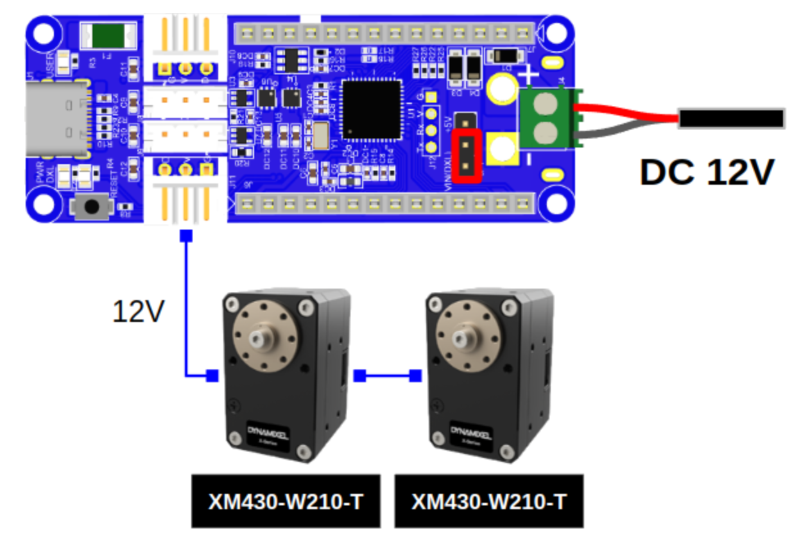

# Gripper Control using Dynamixel 12A and OpenRB-150
Repository containing code to control Dynamixel motor(s) (12A - Tested) with [OpenRB-150](https://emanual.robotis.com/docs/en/parts/controller/openrb-150/) Controller. The software is designed in a way to prevent occurence of the overcurrent in the Dynamixels and enable slippage detection.

## Getting started
1. Download [Arduino IDE](https://www.arduino.cc/en/software) (do not use Ubuntu software manager!).
2. Open the IDE, go to `File->Preferences` and add the below line to the `Additional Boards Manager URLs`:
    ```
    https://raw.githubusercontent.com/ROBOTIS-GIT/OpenRB-150/master/package_openrb_index.json
    ```
3. Download libraries for Arduino IDE (Tools->Manage Libraries): 
    - Arduino SAMD Board Manager
    - OpenRB-150
    - Dynamixel2Arduino
    - CircularBuffer
    - Arduino_JSON
4. Open file `openrb_150_controller.ino` in the `openrb_150_controller` directory, compile it and upload on the microcontroller.

## Setting up the Dynamixel
- Please follow the guide [here](https://emanual.robotis.com/docs/en/parts/controller/openrb-150/).
- Setup video can be found [here](https://www.youtube.com/watch?v=RaNzGhQzlu4).
- For setting the baudrate [here](https://emanual.robotis.com/docs/en/software/dynamixel/dynamixel_wizard2/).
- Connection diagram:
  
- A Molex-JST convertible cable is required to connect the Dynamixel to the OpenRB-150 board.
- For configuring the motors using [Dynamixed Wizard 2.0](https://emanual.robotis.com/docs/en/parts/controller/openrb-150/#dynamixel-wizard-20), you can use the same setup and connect the USB cable to the computer.

> Note: Please make sure to set the Jumper on the OpenRB-150 board to 12V as highlighted in the above image. Otherwise, the motor will not work.

## Dynamixel 12A motor configuration
- ID's: 1, 2
- DXL_PROTOCOL_VERSION: 1.0
- Baudrate: 9600
- Operating mode: Position control
- Inpt voltage: 12V

## Usage
* Connect the USB cable to the microcontroller and the computer.
* Select the Board (OpenRB-150) and Port (e.g. /dev/ttyACM0) in the Arduino IDE (Tools->Board, Tools->Port)
* Open the serial monitor in the Arduino IDE (Tools->Serial Monitor) and set the baudrate to 9600.
* You can see the feedback from the microcontroller in the serial monitor like:
    ```
    gripper_command: 0.00 curr_pos: 448 new_pos: 450 change_state: 0
    {"state":"GRIPPER_OPEN","parsing_error":0,"last_command":0,"left_gripper_pos":129,"right_gripper_pos":166,"diff_encoders":-37}
    ```
* In the Message input window, you can send commands to control the gripper position:
  * `{"command": 0.0}` - open the gripper
  * `{"command": 1.0}` - close the gripper
  * You can also send the command to set the gripper position in the range [0.0, 1.0] (0.0 - open, 1.0 - close): `{"command": 0.5}`
  * If you want to further open the gripper, you can send command in the range [-1.5, 1.0]: `{"command": -1.0}`

## ROS Usage
* For the ROS interface, please check the script at [mas_industrial_robotics](https://github.com/b-it-bots/mas_industrial_robotics/tree/noetic/mir_manipulation/mir_gripper_controller)
